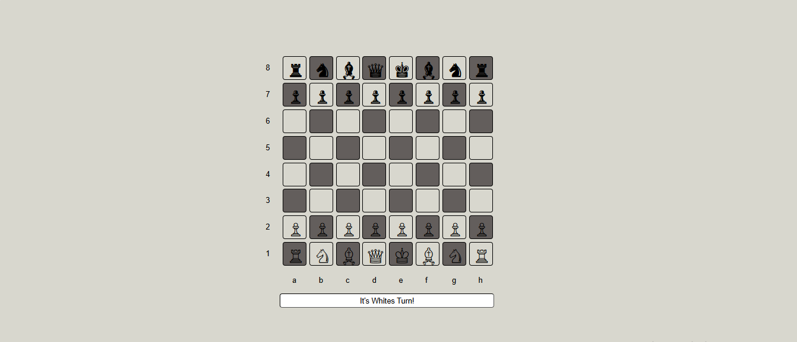

# Web-Based Chess Game

Welcome to the **Chess Game** built using **HTML, CSS, and JavaScript**! This is a fully interactive chess game you can play in your browser, complete with move highlighting and turn-based play logic.

---



## 🌐 Live Preview

> Coming Soon — deploy this game using GitHub Pages or any web host!

---

## 🎮 Features

- ♟️ Classic 8x8 Chessboard
- 👑 All standard chess pieces (King, Queen, Bishop, Knight, Rook, Pawn)
- 🔁 Turn-based logic (White starts first)
- ✨ Move highlighting for selected pieces
- 🚫 Legal move rules for each piece
- 📱 Responsive design for different screen sizes

---

## 📂 Project Structure

chess/
├── index.html # Main HTML file
├── style.css # Styling for the board and pieces
└── script.js # JavaScript logic for movement & rules


---

## 🚀 How to Run the Game Locally

1. **Clone this repository** (or download ZIP)
   ```bash
   git clone https://github.com/yourusername/chess.git
   cd chess
